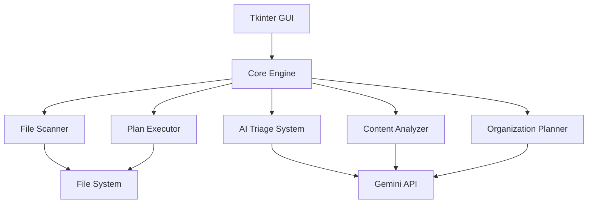

# Design Document

## Overview

The Intelligent File Janitor is designed as a single Python script with Tkinter GUI for rapid development and deployment. This simplified approach focuses on the core AI-powered file organization features while maintaining a clean, functional user interface.

### Technology Stack
- **Language**: Python 3.9+ (single script approach)
- **GUI**: Tkinter (built-in, no external dependencies)
- **AI Integration**: Google Gemini API for content analysis and vision capabilities
- **File Operations**: Python's pathlib and shutil for cross-platform file handling
- **Data Storage**: In-memory only (no database for simplicity)

## Architecture

### Simplified Architecture



### Single Script Architecture

The application is organized as a single Python file with clear class separation:

1. **GUI Layer**: Tkinter interface with folder selection, plan display, and execution controls
2. **Core Engine**: Main application logic coordinating all operations
3. **File Operations**: Scanning, metadata extraction, and file manipulation
4. **AI Integration**: Gemini API calls for content analysis and organization planning

## Components and Interfaces

### 1. Main Application Class

**Purpose**: Coordinate all operations and manage the Tkinter GUI

**Interface**:
```python
class FileJanitorApp:
    def __init__(self):
        self.setup_gui()
        self.scanner = FileScanner()
        self.ai_service = GeminiService()
        self.planner = OrganizationPlanner()
        self.executor = PlanExecutor()
    
    def select_folder(self) -> None
    def analyze_files(self) -> None
    def execute_plan(self) -> None
```

### 2. File Scanner

**Purpose**: Scan directories and extract file metadata

**Interface**:
```python
class FileScanner:
    def scan_directory(self, path: str) -> List[dict]
    def get_file_info(self, file_path: str) -> dict
    def group_by_type(self, files: List[dict]) -> dict
```

### 3. Gemini AI Service

**Purpose**: Handle all AI operations using Google Gemini API

**Interface**:
```python
class GeminiService:
    def __init__(self, api_key: str)
    def analyze_filenames(self, filenames: List[str]) -> dict
    def analyze_text_content(self, text: str) -> dict
    def analyze_image(self, image_path: str) -> dict
    def generate_organization_plan(self, file_analysis: dict) -> dict
```

### 4. Organization Planner

**Purpose**: Create file organization plans based on AI analysis

**Interface**:
```python
class OrganizationPlanner:
    def create_plan(self, files: List[dict], ai_analysis: dict) -> dict
    def generate_folder_structure(self, clusters: dict) -> List[str]
    def suggest_renames(self, files: List[dict], analysis: dict) -> dict
```

### 5. Plan Executor

**Purpose**: Execute file operations safely

**Interface**:
```python
class PlanExecutor:
    def execute_plan(self, plan: dict, dry_run: bool = True) -> dict
    def create_folders(self, folders: List[str]) -> None
    def move_file(self, source: str, destination: str) -> bool
    def rename_file(self, old_path: str, new_name: str) -> bool
```

## Data Models

### Simple Data Structures (In-Memory Only)

```python
# File information dictionary
file_info = {
    'path': str,
    'name': str,
    'extension': str,
    'size': int,
    'modified_date': str,
    'type': str  # 'document', 'image', 'video', 'other'
}

# Organization plan dictionary
organization_plan = {
    'folders_to_create': List[str],
    'file_operations': List[dict],
    'summary': str
}

# File operation dictionary
file_operation = {
    'action': str,  # 'move', 'rename', 'move_and_rename'
    'source': str,
    'destination': str,
    'new_name': str  # optional
}
```

**No Database Required**: All data is kept in memory during the session, making the application lightweight and fast to develop.

## Error Handling

### Simple Error Strategies

1. **File System Errors**
   - Show error message in GUI and continue
   - Skip inaccessible files with user notification
   - Basic validation before file operations

2. **AI Service Errors**
   - Display error message if Gemini API fails
   - Fall back to basic filename-based organization
   - Simple retry mechanism (1-2 attempts)

3. **GUI Errors**
   - Input validation with error dialogs
   - Disable buttons during operations
   - Clear status messages for user feedback

## Testing Strategy

### Manual Testing Focus
- **Core Workflow**: Test scan → analyze → plan → execute cycle
- **File Operations**: Verify files are moved/renamed correctly
- **Error Scenarios**: Test with invalid folders, network issues
- **Different File Types**: Test with various document and image types

### Minimal Automated Testing
- **File Scanner**: Basic unit tests for file detection
- **Plan Generation**: Verify plan structure is correct
- **Safety Checks**: Ensure no data loss in file operations

## Security Considerations

### Basic Safety Measures
- **Confirmation Dialogs**: Require user confirmation before file operations
- **Dry Run Mode**: Show what will happen before actual execution
- **API Key Security**: Store Gemini API key securely (environment variable)
- **File Permissions**: Respect existing file system permissions